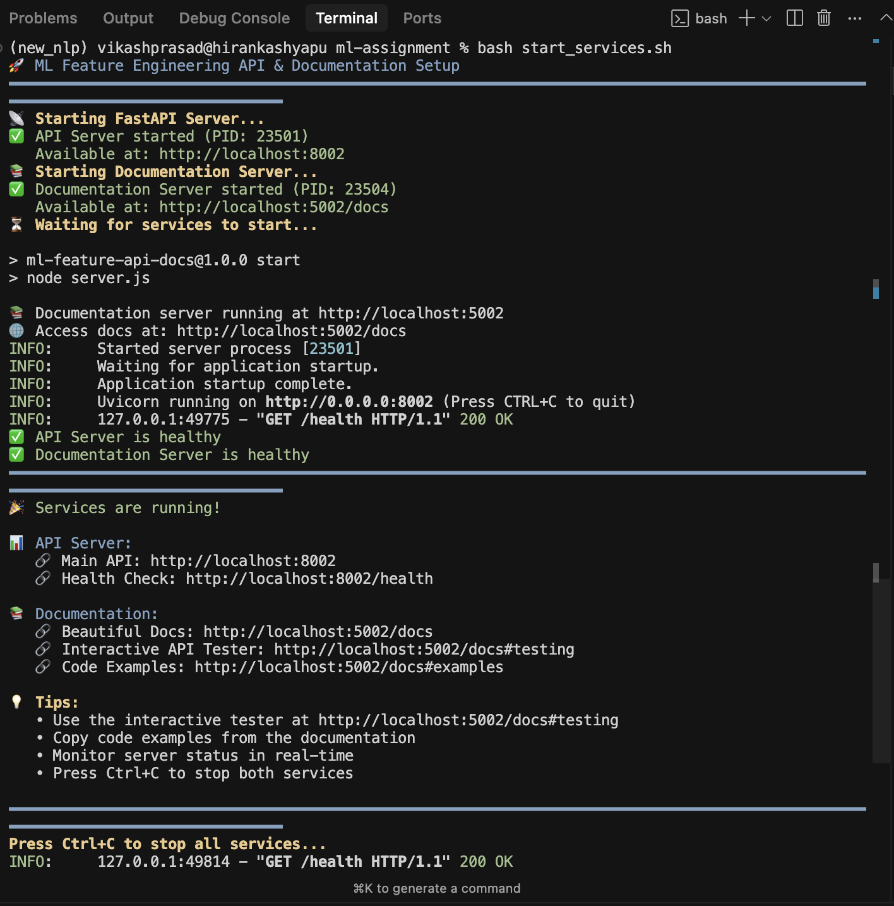
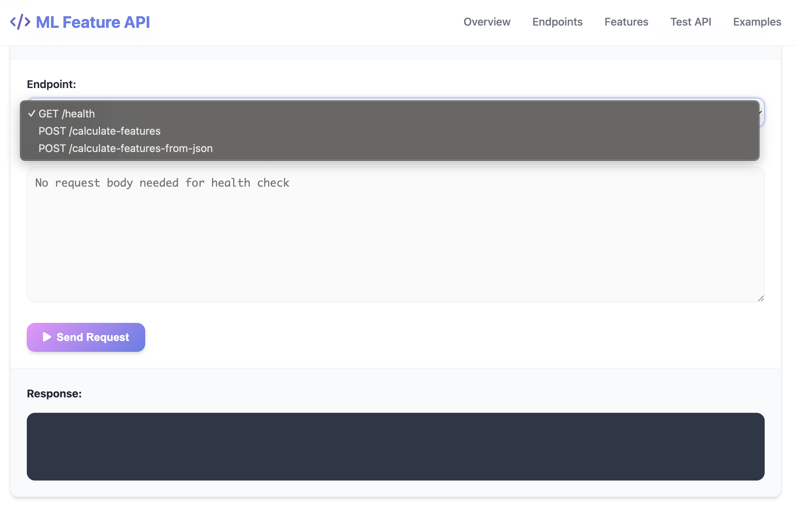

# ML Feature Engineering API Documentation

## Problem Statement

Financial institutions face significant challenges in processing contract data for machine learning applications. The specific problems include:

### Key Challenges
1. **Complex Data Processing**: Financial contract data comes in various formats with inconsistent date formats (DD.MM.YYYY vs ISO format) and mixed data types that require robust parsing and validation.

2. **Critical Feature Engineering**: Three essential features need to be calculated accurately for risk assessment:
   - **tot_claim_cnt_l180d**: Count of claims made within the last 180 days from application date
   - **disb_bank_loan_wo_tbc**: Sum of disbursed loan amounts excluding specific banks (LIZ, LOM, MKO, SUG)
   - **day_sinlastloan**: Number of days since the most recent loan contract

3. **Data Quality Issues**: Handle missing values, invalid dates, and inconsistent data formats while maintaining calculation accuracy.

4. **Scalability Requirements**: Process multiple contracts per application efficiently with real-time response times.

5. **Integration Needs**: Provide a reliable, well-documented API interface that can be easily integrated into existing ML pipelines and risk assessment systems.

6. **Business Logic Complexity**: Implement special handling for edge cases, such as returning -1 for no data scenarios and -3 for no claims scenarios.

---

## What We Solved

Our solution addresses all the identified challenges through a comprehensive FastAPI-based system:

### Technical Solutions Implemented

#### 1. **Robust Data Processing Engine**
- **Flexible Date Parsing**: Handles both DD.MM.YYYY and ISO datetime formats seamlessly
- **Type Safety**: Pydantic models ensure data validation and automatic type conversion
- **Error Handling**: Comprehensive exception handling with meaningful error messages
- **Edge Case Management**: Special value handling (-1, -3) for missing data scenarios

#### 2. **High-Performance API Architecture**
- **FastAPI Framework**: Asynchronous processing for concurrent request handling
- **Automatic Documentation**: Built-in OpenAPI/Swagger documentation generation
- **CORS Support**: Cross-origin resource sharing for browser-based integrations
- **RESTful Design**: Standard HTTP methods and status codes

#### 3. **Accurate Feature Engineering Logic**
- **tot_claim_cnt_l180d**: Precise date arithmetic to filter claims within 180-day window
- **disb_bank_loan_wo_tbc**: Bank filtering logic excluding TBC-related institutions
- **day_sinlastloan**: Intelligent date comparison to find the most recent loan contract

#### 4. **Developer-Friendly Documentation**
- **Interactive API Testing**: Live API tester with real-time validation
- **Code Examples**: Sample requests in Python, JavaScript, and cURL
- **Beautiful UI**: Modern, responsive documentation interface
- **Real-time Monitoring**: Server status indicators and health checks

#### 5. **Production-Ready Features**
- **Health Check Endpoints**: System monitoring and uptime verification
- **Structured Logging**: Comprehensive error tracking and debugging
- **Multiple Input Formats**: Support for both structured JSON and string-based inputs
- **Scalable Architecture**: Designed to handle high-volume production workloads

---

## How to Start the API

### Prerequisites
Before starting the API, ensure you have the following installed:
- **Python 3.8+**: For running the FastAPI server
- **Node.js 14+**: For the documentation server
- **npm**: Package manager for Node.js dependencies

### Quick Start Guide

#### Method 1: Using the Start Script (Recommended)
The easiest way to start both services is using the provided start script:

```bash
# Navigate to project directory
cd ml-assignment

# Make the script executable (Linux/Mac)
chmod +x start_services.sh

# Run the start script
./start_services.sh
```

#### Method 2: Manual Start
If you prefer to start services manually:

```bash
# Terminal 1: Start API Server
cd ml-assignment
python main.py

# Terminal 2: Start Documentation Server
cd docs
npm start
```

### Expected Output
When you run the start script, you should see output similar to this:



**Terminal Output:**
```
🚀 ML Feature Engineering API & Documentation Setup
━━━━━━━━━━━━━━━━━━━━━━━━━━━━━━━━━━━━━━━━━━━━━━━━━━━━━━━━━━━━━━━━━━━━━━━━━━━━━━━━━━━━━━━━━━━━━━━━━━━━━━━━━━━━━━━━━━━━━━━━━━━━━━━━

📡 Starting FastAPI Server...
✅ API Server started (PID: 23501)
   Available at: http://localhost:8002

📚 Starting Documentation Server...
✅ Documentation Server started (PID: 23504)
   Available at: http://localhost:5002/docs

⏳ Waiting for services to start...
✅ API Server is healthy
✅ Documentation Server is healthy

━━━━━━━━━━━━━━━━━━━━━━━━━━━━━━━━━━━━━━━━━━━━━━━━━━━━━━━━━━━━━━━━━━━━━━━━━━━━━━━━━━━━━━━━━━━━━━━━━━━━━━━━━━━━━━━━━━━━━━━━━━━━━━━━
🎉 Services are running!

📊 API Server:
   🔗 Main API: http://localhost:8002
   🔗 Health Check: http://localhost:8002/health

📚 Documentation:
   🔗 Beautiful Docs: http://localhost:5002/docs
   🔗 Interactive API Tester: http://localhost:5002/docs#testing
   🔗 Code Examples: http://localhost:5002/docs#examples

💡 Tips:
   • Use the interactive tester at http://localhost:5002/docs#testing
   • Copy code examples from the documentation
   • Monitor server status in real-time
   • Press Ctrl+C to stop both services

━━━━━━━━━━━━━━━━━━━━━━━━━━━━━━━━━━━━━━━━━━━━━━━━━━━━━━━━━━━━━━━━━━━━━━━━━━━━━━━━━━━━━━━━━━━━━━━━━━━━━━━━━━━━━━━━━━━━━━━━━━━━━━━━

Press Ctrl+C to stop all services...
```

### Service Verification
After starting the services, verify they're running:

1. **API Server**: Visit http://localhost:8002/health
2. **Documentation**: Visit http://localhost:5002/docs
3. **FastAPI Docs**: Visit http://localhost:8002/docs

---

## How to Install Requirements

### Step 1: Environment Setup
```bash
# Navigate to project directory
cd ml-assignment

# Create virtual environment (recommended)
python -m venv ml-env

# Activate virtual environment
# On Windows:
ml-env\Scripts\activate
# On macOS/Linux:
source ml-env/bin/activate
```

### Step 2: Install Python Dependencies
```bash
# Install all Python requirements
pip install -r requirements.txt
```

#### Required Python Packages
The `requirements.txt` file includes:
- **fastapi>=0.104.0**: Web framework for building APIs
- **uvicorn[standard]>=0.24.0**: ASGI server for FastAPI
- **pandas>=2.0.0**: Data manipulation and analysis
- **numpy>=1.24.0**: Numerical computing support
- **pydantic>=2.4.0**: Data validation and serialization
- **python-multipart>=0.0.6**: Support for form data

### Step 3: Install Documentation Dependencies
```bash
# Navigate to docs directory
cd docs

# Install Node.js dependencies
npm install
```

#### Documentation Dependencies
The documentation server requires:
- **express**: Web framework for Node.js
- **cors**: Cross-origin resource sharing
- **body-parser**: Request body parsing middleware

### Step 4: Verify Installation
```bash
# Check Python dependencies
pip list

# Check Node.js dependencies
cd docs
npm list

# Test API server
cd ..
python -c "import fastapi, uvicorn, pandas, numpy, pydantic; print('All Python dependencies installed successfully')"
```

---

## Usage

### API Endpoints Documentation

#### 1. Health Check Endpoint

**Endpoint**: `GET /health`

**Description**: Verifies that the API server is running and healthy.

**Request**:
```bash
curl -X GET http://localhost:8002/health
```

**Response**:
```json
{
  "status": "healthy",
  "service": "ML Feature Engineering Service"
}
```

**Status Codes**:
- `200 OK`: Service is healthy
- `500 Internal Server Error`: Service unavailable

---

#### 2. Root Information Endpoint

**Endpoint**: `GET /`

**Description**: Provides basic API information and available endpoints.

**Request**:
```bash
curl -X GET http://localhost:8002/
```

**Response**:
```json
{
  "message": "ML Feature Engineering Service",
  "description": "Submit application data to calculate financial features",
  "endpoints": {
    "POST /calculate-features": "Calculate features from application data",
    "GET /health": "Health check endpoint"
  }
}
```

---

#### 3. Calculate Features (Structured Format)

**Endpoint**: `POST /calculate-features`

**Description**: Calculates financial features from structured application data.

**Request Schema**:
```json
{
  "id": "string (optional)",
  "application_date": "string (required)",
  "contracts": [
    {
      "contract_id": "string (optional)",
      "bank": "string (optional)",
      "summa": "string (optional)",
      "loan_summa": "string (optional)",
      "claim_date": "string (optional)",
      "claim_id": "string (optional)",
      "contract_date": "string (optional)"
    }
  ]
}
```

**Example Request**:
```bash
curl -X POST "http://localhost:8002/calculate-features" \
  -H "Content-Type: application/json" \
  -d '{
    "id": "application_123",
    "application_date": "2024-02-12T19:24:29.135000",
    "contracts": [
      {
        "contract_id": "CONTRACT_001",
        "bank": "003",
        "summa": "1000000",
        "loan_summa": "800000",
        "claim_date": "10.01.2024",
        "claim_id": "CLAIM_001",
        "contract_date": "15.01.2024"
      },
      {
        "contract_id": "CONTRACT_002",
        "bank": "LIZ",
        "summa": "500000",
        "loan_summa": "400000",
        "claim_date": "05.01.2024",
        "claim_id": "CLAIM_002",
        "contract_date": "20.01.2024"
      }
    ]
  }'
```

**Response**:
```json
{
  "id": "application_123",
  "application_date": "2024-02-12T19:24:29.135000",
  "tot_claim_cnt_l180d": 2,
  "disb_bank_loan_wo_tbc": 800000.0,
  "day_sinlastloan": 23
}
```

**Feature Explanations**:
- **tot_claim_cnt_l180d**: Number of claims within 180 days (2 claims found)
- **disb_bank_loan_wo_tbc**: Sum of loans excluding TBC banks (LIZ bank excluded)
- **day_sinlastloan**: Days since most recent loan (23 days from CONTRACT_002)

---

#### 4. Calculate Features (JSON String Format)

**Endpoint**: `POST /calculate-features-from-json`

**Description**: Calculates features from CSV-style JSON string data format.

**Request Schema**:
```json
{
  "id": "string (optional)",
  "application_date": "string (required)",
  "contracts": "string (JSON array as string)"
}
```

**Example Request**:
```bash
curl -X POST "http://localhost:8002/calculate-features-from-json" \
  -H "Content-Type: application/json" \
  -d '{
    "id": "application_456",
    "application_date": "2024-02-12 19:24:29.135000+00:00",
    "contracts": "[{\"contract_id\": \"CONTRACT_001\", \"bank\": \"003\", \"summa\": \"1000000\", \"loan_summa\": \"800000\", \"claim_date\": \"10.01.2024\", \"claim_id\": \"CLAIM_001\", \"contract_date\": \"15.01.2024\"}]"
  }'
```

**Response**:
```json
{
  "id": "application_456",
  "application_date": "2024-02-12 19:24:29.135000+00:00",
  "tot_claim_cnt_l180d": 1,
  "disb_bank_loan_wo_tbc": 800000.0,
  "day_sinlastloan": 28
}
```

---

### Programming Examples

#### Python Example
```python
import requests
import json

# API configuration
API_BASE_URL = "http://localhost:8002"

# Example data
data = {
    "id": "python_example_001",
    "application_date": "2024-02-12T19:24:29.135000",
    "contracts": [
        {
            "contract_id": "CONTRACT_001",
            "bank": "003",
            "summa": "1000000",
            "loan_summa": "800000",
            "claim_date": "10.01.2024",
            "claim_id": "CLAIM_001",
            "contract_date": "15.01.2024"
        }
    ]
}

# Send request
try:
    response = requests.post(f"{API_BASE_URL}/calculate-features", json=data)
    
    if response.status_code == 200:
        result = response.json()
        print("✓ Features calculated successfully:")
        print(f"  - ID: {result['id']}")
        print(f"  - Application Date: {result['application_date']}")
        print(f"  - Claims (180d): {result['tot_claim_cnt_l180d']}")
        print(f"  - Disbursed Loans: {result['disb_bank_loan_wo_tbc']}")
        print(f"  - Days since last loan: {result['day_sinlastloan']}")
    else:
        print(f"✗ Error: {response.status_code} - {response.text}")
        
except requests.RequestException as e:
    print(f"✗ Request failed: {e}")
```

#### JavaScript Example
```javascript
// JavaScript example using fetch
async function calculateFeatures() {
    const apiUrl = 'http://localhost:8002/calculate-features';
    
    const data = {
        id: 'js_example_001',
        application_date: '2024-02-12T19:24:29.135000',
        contracts: [
            {
                contract_id: 'CONTRACT_001',
                bank: '003',
                summa: '1000000',
                loan_summa: '800000',
                claim_date: '10.01.2024',
                claim_id: 'CLAIM_001',
                contract_date: '15.01.2024'
            }
        ]
    };
    
    try {
        const response = await fetch(apiUrl, {
            method: 'POST',
            headers: {
                'Content-Type': 'application/json',
            },
            body: JSON.stringify(data)
        });
        
        if (response.ok) {
            const result = await response.json();
            console.log('✓ Features calculated successfully:');
            console.log('  - Claims (180d):', result.tot_claim_cnt_l180d);
            console.log('  - Disbursed Loans:', result.disb_bank_loan_wo_tbc);
            console.log('  - Days since last loan:', result.day_sinlastloan);
        } else {
            console.error('✗ Error:', response.status, await response.text());
        }
    } catch (error) {
        console.error('✗ Request failed:', error);
    }
}

// Call the function
calculateFeatures();
```

---

### Error Handling

#### Common Error Responses

**400 Bad Request**:
```json
{
  "detail": "Error calculating features: Invalid date format"
}
```

**422 Unprocessable Entity**:
```json
{
  "detail": [
    {
      "loc": ["body", "application_date"],
      "msg": "field required",
      "type": "value_error.missing"
    }
  ]
}
```

**500 Internal Server Error**:
```json
{
  "detail": "Internal server error"
}
```

---

### Interactive Testing

For interactive testing, visit the documentation server at:
- **Beautiful Docs**: http://localhost:5002/docs
- **Interactive Tester**: http://localhost:5002/docs#testing
- **Code Examples**: http://localhost:5002/docs#examples



The interactive tester allows you to:
1. Test API endpoints directly from your browser
2. Modify request parameters in real-time
3. View formatted responses
4. Generate code examples in multiple languages
5. Monitor API server status

---

### Troubleshooting

#### Common Issues

1. **Port already in use**: If ports 8002 or 5002 are occupied, modify the port settings in `main.py` and `docs/server.js`

2. **Dependencies not installed**: Ensure all requirements are installed using `pip install -r requirements.txt`

3. **CORS errors**: The API includes CORS middleware for localhost origins. For production, update the allowed origins.

4. **Date format issues**: Ensure dates are in DD.MM.YYYY format for contract dates or ISO format for application dates

5. **Invalid JSON**: When using the JSON string endpoint, ensure the contracts string is properly escaped JSON

For additional support, check the server logs or visit the interactive documentation for real-time testing. 